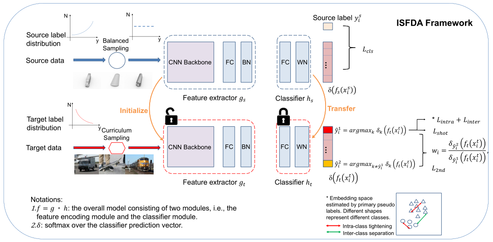

# Imbalanced Source-free Domain Adaptation
### Framework

------



### Prerequisites

------

- python == 3.7.10

- pytorch == 1.2.0

- torchvision == 0.4.0

- numpy, scipy, sklearn, argparse, PIL

### Datasets:

------

Please download the VisDA-C dataset, Office-Home dataset and DomainNet dataset from the following links:

- VisDA-C: http://csr.bu.edu/ftp/visda17/clf/

- Office-Home: https://drive.google.com/file/d/0B81rNlvomiwed0V1YUxQdC1uOTg/view
- DomainNet: http://ai.bu.edu/M3SDA/

Organize the datasets into the following file structure where `ISFDA` is the parent folder of the datasets.

```
ISFDA
├── data
    ├── domainnet
    ├── office-home
    ├── VISDA-C
    ├── office-home-RSUT
    ├── VISDA-RSUT
    ├── VISDA-RSUT-50
    ├── VISDA-RSUT-10
    ├── VISDA-Beta
    ├── VISDA-Knockout
    └── VISDA-Tweak
```

We have put the txt files that record image paths and labels of each datasets in the corresponding folder. By default, we assume the paths of DomainNet, Office-Home, VisDA-C are /data/DomainNet, /data/Office_home, and /data/VisDA_C respectively, but they could be customized. 

Txt files that record the data split for VisDA-RSUT, VisDA-RSUT-50, VisDA-10 are created by us following the protocol of the [BBN](https://openaccess.thecvf.com/content_CVPR_2020/papers/Zhou_BBN_Bilateral-Branch_Network_With_Cumulative_Learning_for_Long-Tailed_Visual_Recognition_CVPR_2020_paper.pdf) paper for long-tail visual recognition, and VisDA-Beta, VisDA-Knockout, VisDA-Tweak follow the protocol of the [BBSE](http://proceedings.mlr.press/v80/lipton18a/lipton18a.pdf) paper. 

The last three datasets are not used in the original paper, and they simulate more situations of label shift to test the generality of Secondary Label Correction (SLC), i.e., to compare SHOT with SHOT+SLC. 

| Method   | Beta(a=1.2,b=2) | Beta(a=2,b=2) | Beta(a=2.7,b=2) | Tweak | Knock out |
| -------- | --------------- | ------------- | --------------- | ----- | --------- |
| SHOT     | 70.27           | 70.63         | 72.34           | 80.61 | 74.24     |
| SHOT+SLC | 73.02           | 73.59         | 77.74           | 81.61 | 74.77     |

We simply adopt the same parameters as those for VisDA-RSUT, and better results could be achieved with more tuning.

Our code is partly borrowed from [SHOT](http://proceedings.mlr.press/v119/liang20a/liang20a.pdf).

We thank Shuhan Tan for providing the data split txt files for Office-Home (RSUT) and DomainNet in their [COAL](https://arxiv.org/abs/1910.10320) paper.

### Training

------

1. #####  Training on the Office-Home (RSUT) dataset

   - Train model on the source domain **Clipart**(s = 1).

    ```python
   cd ./object
   python image_source.py \
   --trte stratified \
   --da uda \
   --output ./exp_home/src \
   --gpu_id 0 \
   --dset office-home-RSUT \
   --max_epoch 20 \
   --s 1 \
   --source_balanced
    ```

   - Adaptation to target domains **Product**(t=1) and **Real World**(t=3) one by one.

    ```python
   python image_target_multi_lb_2.py
   --cls_par 0.3 \
   --da uda \
   --dset office-home-RSUT \
   --max_epoch 20 \
   --gpu_id 0 \
   --s 1 \
   --output_src ./exp_home/src \
   --output ./exp_home/isfda \
   --net resnet50 \
   --lr 1e-2  \
   --topk_ent \
   --scd_label \
   --intra_dense \
   --inter_sep
    ```

2. ##### Training on the VisDA-C (RSUT) dataset

   - Train model on the source domain **Train_RS**(s = 0).

    ```python
   cd ./object
   python image_source.py \
   --trte val \
   --output ./exp_visda/src \
   --da uda \
   --gpu_id 0 \
   --dset VISDA-RSUT \
   --max_epoch 15 \
   --s 0 \
   --t 1 \
   --net resnet101 \
   --lr 1e-3 \
   --source_balanced
    ```
   
   - Adaptation to target domain **Validation_UT**(t = 1).
   
   ```python
   python image_target_multi_lb_2.py \
   --cls_par 0.3 \
   --da uda \
   --dset VISDA-RSUT \
   --gpu_id 0 \
   --s 0 \
   --output_src ./exp_visda/src \
   --output ./exp_visda/isfda \
   --net resnet101 \
   --lr 1e-3  \
   --topk_ent \
   --scd_label \
   --intra_dense \
   --inter_seq
   ```
   
3. **Training on the DomainNet dataset**

   - Train model on the source domain **Clipart**(s=0).

   ```PYTHON
   cd ./object
   python image_source.py \
   --trte stratified \
   --output ./exp_dom/src \
   --da uda \
   --gpu_id 0 \
   --dset domainnet \
   --max_epoch 20 \
   --s 0 \
   --t 1 \
   --net resnet50 \
   --lr 1e-2 \
   --source_balanced
   ```

   - Adaptation to target domains **Painting**(t=1), **Real**(t=2), **Sketch**(t=3) one by one.

   ```python
   cd ./object
   python image_target_multi_lb_2.py \
   --cls_par 0.3 \
   --da uda \
   --dset domainnet \
   --max_epoch 15 \
   --gpu_id 0 \
   --s 0 \
   --output_src ./exp_dom/src \
   --output ./exp_dom/isfda \
   --net resnet50 \
   --lr 1e-2  \
   --topk_ent \
   --scd_label \
   --intra_dense \
   --inter_seq
   ```

### Citation

------

```
@inproceedings{li2021imbalanced,
  title={Imbalanced Source-free Domain Adaptation},
  author={Li, Xinhao and Li, Jingjing and Zhu, Lei and Wang, Guoqing and Huang, Zi},
  booktitle={Proceedings of the 29th ACM International Conference on Multimedia},
  pages={3330--3339},
  year={2021}
}
```

